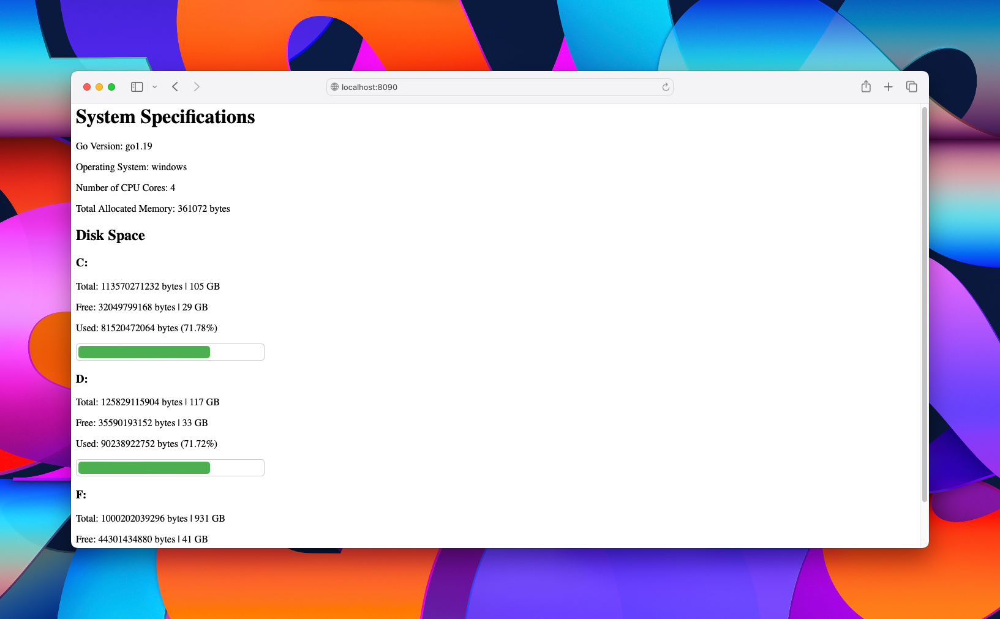

# winDiskServ


   
winDiskServ is a simple Go program that provides system specifications and disk space information through a web interface. It runs as a service on Windows, allowing you to access the information remotely on the same LAN.

## Features

- Displays system specifications, including Go version, operating system, and CPU information.
- Shows total, free, and used disk space for all available drives.
- Visualizes disk usage with a progress bar.

## Requirements

- Go 1.12 or later
- [NSSM (Non-Sucking Service Manager)](https://nssm.cc/download) for running the program as a Windows service.

## Installation

1. Download and install NSSM from [https://nssm.cc/download](https://nssm.cc/download).

2. Clone the repository:

    ```bash
    git clone https://github.com/yourusername/winDiskServ.git
    ```

3. Navigate to the project directory:

    ```bash
    cd winDiskServ
    ```

4. Install the Go dependencies:

    ```bash
    go get -u github.com/shirou/gopsutil/disk
    ```

5. Build the executable:

    ```bash
    go build
    ```

6. Install winDiskServ as a Windows service using NSSM:

    ```bash
    nssm install winDiskServ "path\to\winDiskServ.exe"
    ```

7. Configure the service and adjust firewall settings as needed.

8. Start the service:

    ```bash
    nssm start winDiskServ
    ```

## Usage

- Access the web interface by navigating to `http://<machine_ip>:8090` from a web browser on the same LAN.

## License

This project is licensed under the MIT License - see the [LICENSE](LICENSE) file for details.

## Acknowledgments

- This program uses the [gopsutil](https://github.com/shirou/gopsutil) library for disk space information.

## Contributing

Feel free to open an issue or submit a pull request for any improvements or bug fixes.

## Authors

- [Lahiru Himesh](https://sdglhm.com)